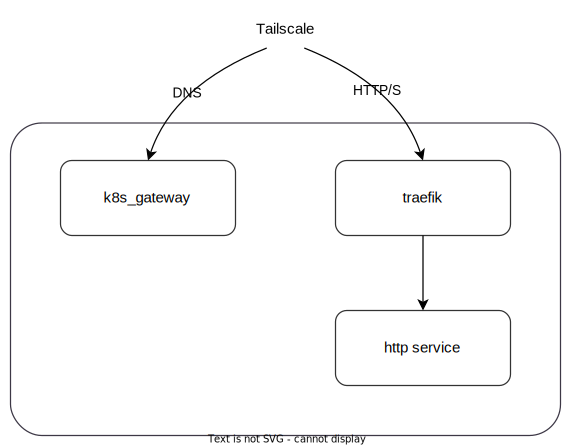

---

GitOps for my Kubernetes cluster defined with [nixidy](https://github.com/arnarg/nixidy).

## Folder Structure

- `charts/` - Extra Helm Charts (that are not available in [nixhelm](https://github.com/farcaller/nixhelm)) used in the cluster config.
- `manifests/` - Plain YAML Kubernetes manifests that are rendered by nixidy. Argo CD will watch these folders for updates.
- `modules/` - Nixidy modules that define all the different applications for the cluster.
- `configuration.nix` - Special configuration for the `prod` env (and the only env).
- `flake.nix` - A nix flake setting up the nixidy configuration.

## Networking

The cluster runs on k3s and uses Cilium for CNI.

### Exposing services

Services are only accessible inside my tailscale tailnet. Using tailscale-operator 2 services are exposed, traefik and k8s_gateway.

[k8s_gateway](https://github.com/ori-edge/k8s_gateway) is a CoreDNS plugin which will resolve the hostname set in Ingresses to the ip or hostname set in `.status.loadBalancer.ingress` of the same `Ingress` object.

[traefik](https://traefik.io/traefik/) proxies all Ingresses and updates their `.status.loadBalancer.ingress` to its own Service's external IP, which is set by tailscale-operator.

With this setup I then just have to set up split DNS in tailscale console to resolve my domain by sending those queries to the address of k8s_gateway. All queries will resolve to traefik's address and it will proxy it forward to the service with the specified hostname in its `Ingress` object.

